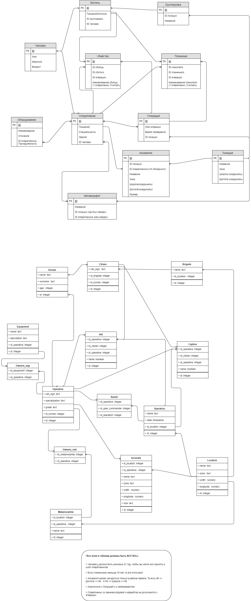

# areal-postgresql

## Учебный проект по проектированию и созданию Базы Данных.

<code>
</code>

# Небольшой сюжет:

## Основная информация:
Имеется РАО “Ареал”, практически независимая корпорация, со своей армией, городами, и правительством. Не является полной марионеткой государства (как бы государство в государстве) в силу нахождения в запретной зоне (см. ниже).
Внутри РАО основной и самой важной, опасной работой заняты оперативники. В их задачи входят патрули, охрана экспедиций, организация экспедиций, поиск метов (см. Метаморфиты), поимка преступников, обнаружение нелегальных лабораторий и пр. , обнаружение аномалий внутри городов с использованием различных технологий. 

Имеется запретная зона. Зона образована(зародилась) в марте 1991 года, вследствии падения на Землю неизвестного и неизученного метеорита в Республике Коми. На самом деле являющийся инопланетным кораблем иномерной жизни, который впоследствии занимается перестройкой некоторой области земной биосферы под свои нужды.
“Ареал” - это и есть запретная зона. Вход и въезд туда на бумаге запрещены, но на деле никто сильно не следит, так как вернуться к нормальной жизни(в обычном его понимании) после посещения этого места невозможно.
Структурно Ареал представляет систему концентрических кругов идеально правильной формы. Со спутников территория Ареала не просматривается, выглядя как единая окружность красного цвета.
В Ареале есть 4 основные зоны: Зеленая, Желтая и Красная, Красная и Эпицентр. Они расположены в порядке возрастания опасности.
Барьер между зонами имеет толщину около 3 сантиметров, хотя глазами это расстояние увидеть невозможно. По ощущениям перемещение между зонами происходит мгновенно, но на самом деле объект проходит некоторое расстояние, прежде чем оказаться в другой зоне.
Нельзя стоять на границе двух зон (это не относится к границе Ареала и Большой земли) - человека или предмет мягко, но непреодолимо тянет в ту сторону, куда был направлен вектор его инерции. Этот феномен известен еще с самого появления Зон.
Воды как таковой в Ареале нет. Периодически возникающие озерца наполнены некоей субстанцией, воду напоминающей лишь отдалённо. Она абсолютно неподвижна, больше напоминает стекло. Эти озерца даже Аномалии предпочитают огибать по широкой дуге, не приближаясь к ним. В остальном они выглядят вполне обычно. Иногда даже имеется узкая полоска вполне нормального песка, обрамляющая берег, резко контрастируя с окружающей действительностью. Ареаловская вода пригодна для питья только мутантам. Для обычных людей воду в Ареал завозят извне, с Большой земли.
В Ареале не пьют ничего кроме воды. На человека выпившего даже простой чай или кофе начинают бросаться животные, а на алкогольные напитки могут придти хорошо вооруженные отряды Зомби (иногда в количестве нескольких рот).
В Ареале не может быть большого огня. Зажигалку зажечь можно, но если что-то загорается, то практически сразу пожар тухнет сам собой.
#### Зеленая зона:
Самая “безобидная” из всех представленных зон. В ней люди подвергаются так называемой зависимости, и при выходе из Ареала, в незараженную среду, испытывают сильный, нарастающий Зуд, который невозможно излечить, но при возвращении в зону, Зуд моментально проходит. Есть сравнительно немного маленьких аномалий (см. Аномалии), движущихся из них около 2-3 процентов. Кол-во больших же аномалий по всей зоне не превышает 1 процента от всех. Самая большая зона из всех представленных по площади и по количеству проживающего населения (около 95 процентов). Электричество, все удобство цивилизации тут еще работают, техника движется, самолеты, вертолеты летают. Радиосвязь работает по всей зоне, возможно связываться с внешним миром.

#### Желтая зона:
Радиосвязи больше нет, невозможно соединиться физически, рации отключаются. Также нет электричества. Исключения - использовать устройства вместе с метаморфитом “Осколок” (см. Метаморфиты). Техника больше не движется, даже велосипед не поедет, будет ломаться каждые 5 метров. Движение возмозможно лишь пешком. Много маленьких аномалий (см. Аномалии), движущихся из них около 10-15 процентов. Кол-во больших же аномалий по всей зоне не превышает 10 процентов от всех.

#### Красная зона:
Вход туда по регламенту строжайше запрещен. Вернуться в здравом уме невозможно. Моментальное превращение в Зомби (см. Зомби). Эта зона буквально кишит большими, движущимися аномалиями. Толком не изучена.

#### Эпицентр:
Апогей красной зоны. Есть данные только от двух оперативников. Это центр - где находится иноземная жизнь. По данным уникальных оперативников - жизнь там отличается от всех Зон, попасть туда в здравом уме - невозможно, исключения - 2 оперативника из нашего штата.
Ареал растет: стабильно на один метр в сутки, при выбросах (событие при котором все выглядит как начало сильнейшей бури, в это время надо быть внутри построек ниже уровня земли. Иначе выброс убивает всех, кто оказался на открытой местности, а спрятавшиеся в постройках выше уровня земли становятся зомби (см. Существа Ареала) — до километра за 26 секунд. При этом ширина зон остаётся той же, прирастает центр.
В Зонах добывается особенная нефть - Икс. Энергетическая ценность которой в много раз выше обычной. В Зеленой Зоне в 50 раз, в Желтой - в 120 раз, по Красной и Эпицентру информации нет. Основная задача РАО “Ареал”, поддержание добычи Икса. Также в задачи РАО входит поддержание порядка по всей Зоне. 
Внутри РАО

## Аномалии:
#### Воронка
Воронка, предположительно, является Аномалией Жёлтой Зоны. Может быть как движущейся, так и неподвижной.
Попавший в неё предмет приподнимает над землёй и стремительно затягивает внутрь, где расщепляет на молекулы. Если в Аномалию вляпается человек, то, перед тем как распустить на молекулы, его тело сминается в кровавый комок с отчетливым хрустом ломающихся костей и рвущихся мышечных тканей. В итоге от человека остаётся лишь кучка окровавленного тряпья.

#### Газовая Аномалия
Газовая Аномалия представляет собой бесцветное облако газообразного отравляющего вещества, свободно перемещающееся по зонам. Движется достаточно быстро, убежать от неё невозможно. Встречается во всех зонах. Естественно, не видима, но при её приближении слышно тихое шипение. После того, как послышалось шипение, у человека есть 8 секунд, чтобы надеть противогаз. Если дышать ею больше этого времени, наступает неминуемая смерть. Также важно отметить, что после надевания противогаза необходимо сделать глубокий выдох и только после этого открывать глаза. Если этого не сделать, можно вдохнуть частицы отравляющего вещества, успевшие попасть в маску противогаза и носовые пазухи.
Доподлинно неизвестно, имеет ли Газовая Аномалия запах, т.к. «счастливчики», понюхавшие её, уже никому ничего и никогда не расскажут.
Газовая Аномалия бывает отравляющей, в этом случае достаточно просто надеть противогаз, и едкой отравляющей, в этом случае с открытой кожей внутрь неё лучше не попадать.

#### Грава
Грава - гравитационный конденсатор, область пространства с измененной физикой. Внутри него сила гравитации составляет, по разным оценкам, от пятидесяти до ста «g». Иными словами, всё, попавшее в неё, с коротким глухим чавканьем мгновенно превращается в лепёшку.
Иногда Граву можно определить по едва различимому мареву над тропинкой, но чаще её не видно и не слышно. Из-за этого в ней сгинуло множество людей. Вычислить её можно только по слабому запаху озона, да и тот чувствуется шагов за пять-семь. После Дезинфекции официально считается, что аномалия перестала выделять озон. Но на самом деле он остался, просто стал едва ощутим и не распространяется дальше метра за пределами аномалии.

#### Жаровня
Под воздействием Аномалии все высокоорганизованные существа нагреваются, т.е., по сути, аномалия воздействует только на людей и животных. Окружающая фауна, насекомые и предметы остаются холодными.
Мембрана рассчитана на сопротивление Жаровне и облаченный в неё человек вполне может выжить, если его заденет самым краем аномалии. В центре аномалии воздействие столь велико, что даже в Мембране человек очень быстро изжарится (либо лёгкие сгорят, либо мозги расплавятся).
После Дезинфекции учёным ОСОПа удалось улучшить мембрану, и в ней стало возможно выжить и на более близком к центру Аномалии расстоянии

#### Жернова
Жернова - одна из аномалий Ареала. Попавшего в неё человека или предмет мгновенно перемалывает.
Может быть как неподвижной, так и движущейся. Имеет интересную форму - усеченная сфера, т.е. у земли ее поперечное сечение меньше, чем на высоте.

#### Зыбь
Самая опасная из всех аномалий. Воздух рядом с зыбью едва заметно подрагивает, напоминая рябь кристально чистой воды.
Встречается во всех зонах кроме Зеленой. Способна двигаться, причем иногда очень быстро. Разглядеть её возможно только днём и только при ярком свете (когда воздушное колебание заметно).
По структуре напоминает что-то вроде очень сильной кислоты, только газообразная. Человека разъедает мгновенно, «Мембрану» — секунды за три. Совершенно непредсказуемая: может месяцами сидеть на одном месте, а может выползти откуда-нибудь на тропу, по которой ты только что прошёл, чтобы устроить на обратном пути сюрприз…
Но самая главная опасность этой аномалии в том, что, в отличие от остальных, она может «затечь» в помещение (для этого ей достаточно даже самого крохотного отверстия).
Визуально очень похожа на Лизуна.

#### Лизун
Лизун - добрая, безобидная аномалия. Очень похож на Зыбь: выглядит также (рябь в воздухе как на поверхности кристально прозрачно воды). Может двигаться и иногда очень быстро. Разглядеть можно только днём, при ярком свете (когда воздушное колебание заметно).
От Зыби его отличает только запах сдобных булочек, почуять который можно только находясь на очень небольшом расстоянии. Находясь внутри лизуна, человек ощущает, будто его вылизывает маленький щенок. В этот момент от него пахнет как от одномесячного щенка. Пробыв внутри аномалии продолжительное время, человек может утолить жажду, но и одежда при этом намокнет.
Видимость в чреве Лизуна напоминает вид из-под воды, если смотришь без плавательных очков или маски. Метров с пяти уже толком ничего не разобрать.
Если в Лизуна бросить предмет, то он бросит его обратно, но не сильно - с тем же усилием, что и ты в него.
Этого никто из людей не знает, но Лизун на самом деле являет точкой локального перехода: имея специальный метаморфит-ключ, можно пройти Лизуна насквозь и выйти в другой точке пространства.

#### Магнит
Про магнит в книгах упоминаний достаточно мало.
Известно лишь, что он притягивает металл (причем крупный Магнит начинает притягивать его с нескольких метров).
По словам автора, если человек попадет в эту аномалию, его мгновенно разложит на атомы.

#### Миротворец
Аномалия заманивает жертву внутрь себя, создавая у неё ложное ощущение спокойствия и умиротворения. Является Аномалией Желтой Зоны.
Внешне выглядит как ровная и аккуратная лужайка, покрытая недлинным, но густым ковром чистой зелёной травы на которую очень хочется прилечь и отдохнуть. От вступившего в неё человека не останется ничего кроме кучки окровавленного тряпья, распущенного на лоскуты. Упавший на лужайку предмет просто исчезает, но в момент его падения ни одна травинка не шелохнется.
Способна двигаться, но не быстро.

#### Мясорубка
Мясорубка - одна из аномалий Ареала. Попавшего в неё человека или предмет с тихим чавканьем очень быстро перемелет в однородную кашицу.
Может возникнуть в любой из зон, за исключением Эпицентра. Большая мясорубка может достигать до четырёх метров в диаметре.

#### Оковы
Название аномалии не случайно. Она не убивает человека, но намертво приковывает его к земле. Наступивший в неё человек падает и не может сдвинуться с места, словно прикованный.
Считается Аномалией Желтой Зоны, но изредка может появиться в Зелёной. Сама она не видна, но трава в ней как бы приминается, складываясь в рисунок в виде кляксы полтора метра в поперечнике. Аномалия не движется, поэтому обходить можно практически вплотную, главное - не задеть «брызги», отходящие от основной кляксы.
Если идешь с группой, то вдвоём попавшего в Оковы вытащить можно, одному не хватит сил. Многие одиночки так и умирали от жажды, прикованные к земле. Вляпавшегося человека вытаскивать надо за то, что торчит за пределами Аномалии (совершенно не важно что это будет: руки, ноги или даже голова). Если удалось вытащить - можно радоваться - отделался легким испугом.
Существует очень редкий метаморфит способный сделать своего владельца нечувствительным к действию Оков. Называется он «отмычка». Если носить его в специальном набедренном кармане, Оковы на носителя не действуют, хоть пляши на них. Но если Отмычка лежит в рюкзаке, то сначала прикует, а это довольно болезненный удар о землю. Но потом можно выползти без проблем.

#### Паутина
Паутина - самая простая из аномалий. Представляет собой (как ни странно) паутину из густо расположенных тонких серебристых нитей, растянувшихся между двумя близко расположенными объектами (не дальше 5 м). Встречается в Желтой и Зеленой зонах. Она появляется, растягиваясь и цепляясь за относительно вертикальные предметы, либо за поверхности, имеющие выступы. Никогда не растягивается строго вертикально и с горизонтальных поверхностей. Возникает только под открытым небом.
Данная аномалия двумерна, потому её можно увидеть глазами в закатных или рассветных сумерках, а также в полумраке (например в тени, отбрасываемой густой растительностью). Днем и ночью она не видна. Также отблески её нитей можно обнаружить, если чиркнуть вблизи колёсиком кремниевой зажигалки.
При прохождении через неё какого-либо предмета или человека раздается треск. Поначалу многие сталкеры и поисковики, начитавшиеся фантастики, думали, что этот звук означает разрыв паутины, пытались её счистить палкой, а затем проходили. Это было большой ошибкой: паутину столь простым способом не убрать. Треск говорит о передаче предмету энергии. Сама же паутина никуда не пропадает, а лишь переходит в невидимый для глаза диапазон.
Прошедшего через неё человека неминуемо ожидает смерть от разрыва сердца. Но происходит это не сразу. У всех людей смерть наступает через неопределённый промежуток времени: от минуты до полугода. Умирающие, как правило, перед смертью успевают обратить внимание на странную пустоту и тишину в груди.

#### Плешь
Попавший в неё предмет мгновенно превращается в труху. Если вляпается человек, от него остается только кровавая пыль с крошечными кусочками тряпья.

#### Пух
Обычный древесный пух, изменившийся под действием Ареала. Имеет неопределенный мутновато жёлто-белёсый цвет и представляет собой токсичную едкую гадость, при попадании на открытые поверхности тела разъедает кожу, словно кислота, естественно, оставляя сильный ожог.
Несмотря на то, что сухой, легко налипает на лицевые щитки противогазов, быстро залепляя их подобно снегу и мешая обзору.
Встречается в Желтой и Зеленой зонах. В Зеленой летает, огибая аномалии. Но в Желтой летает свободно, там ему Аномалии безразличны.

#### Пушка
Пушка, также как и Центрифуга или Рулетка, возвращает попавшие внутрь неё предметы, но с некоторым отличием. Брошенный в неё предмет «захватывается», т.е зависает на 2-3 секунды. Считается, что в этот момент Пушка как бы энергию накапливает. А потом выстреливает предмет обратно, словно пушечное ядро. Очень сильно бьёт.
Пушку вполне можно увидеть глазами. Воздух в ней как бы колышется, словно марево или лёгкий пар.
Человека, если внутрь угодит, метров на пятьдесят запросто забрасывает. Что гарантирует смерть. Из-за того, что Аномалия эта встречается в Желтой Зоне, то человек, попавший в неё, либо погибнет сразу, либо попадет в другую аномалию.

#### Раздиратель
Раздиратель - одна из аномалий Ареала, часто встречающаяся в Желтой и Красной зонах.
Человека, попавшего внутрь неё, мгновенно разрывает в клочья, в связи с чем аномалия и получила своё название.
С Ариадной выглядит как нечто, хаотично переливающееся энергиями. Некоторые Раздиратели пульсируют, то раздуваясь, то сужаясь в объеме. Подрастая, Раздиратели получают способность к перемещению.

#### Рулетка
Рулетка выглядит как прозрачное облако, вроде дрожащего марева. По принципу действия похожа на Центрифугу. Также возвращает брошенный в неё предмет. Но, с некоторым отличием: брошенное в неё вылетает в случайном направлении.
Является, в основном, аномалией Желтой Зоны. Её появление в Зелёной Зоне в принципе возможно, но это случай исключительный.

#### Свечение
Представляет собой серебристое облако, переливающееся красными сполохами, висящее над самой землёй, примерно с кубометр размерами. Само светится, не освещая при этом пространства вокруг.
Встречается во всех зонах.
Имеет полезное свойство: если на него пару минут посмотреть, начинаешь видеть в кромешной тьме словно днём, этот эффект держится где-то с полчаса. Если смотреть на свечение в Желтой зоне, то эффект длится значительно дольше. Днем лучше не смотреть - глаза начинают болеть.

#### Сито
При попадании в неё предмета с тихим скрежетом распускает его в подобие крошечных иголок, как будто тот прошел через гигантское сито. С человеком будет тоже самое, но останки одежды будут перемешаны с кровью.
Определить Сито достаточно просто, если быть внимательным. При приближении к Аномалии пропадают все запахи и трава под ней шевелится странно и неестественно.
Более ничего не известно, т.к данная аномалия упоминается достаточно редко.

#### Соленоид
Соленоид - аномалия, бьющая разрядами, вроде электрических, в радиусе до девяти метров от себя. Любит забраться куда-нибудь на кочку или на склон какой-нибудь и оттуда колотит во всё, что приблизится.
Увидеть невозможно, но реально почувствовать: Соленоид определяется по характерному привкусу воздуха. Как почувствовал на языке солёный воздух - ближе десяти метров к выступающим складкам местности лучше не подходить.

#### Студень
Является одной из простых аномалий, т.е. его можно при определённых условиях увидеть невооруженным глазом. Возникает после Выбросов практически во всех рытвинах и углублениях в земле.
Увидеть Студень можно днем с помощью изделия «Филин». А ночью он начинает светиться слабым фиолетовым светом. Поэтому вляпываются в Студень чаще всего по невнимательности, неаккуратности или когда убегают от кого-то/чего-то.
Наступивший в него человек постепенно размякнет, плавно превращаясь в субстанцию напоминающую студень. Если всё-таки вляпался, то единственный способ избежать участи полного превращения в студень - это ампутация конечности выше того места, которое уже размякло.

#### Туча
Туча выглядит как небольшое облако, висящее в 10 метрах над землёй. Особенно любит низины.
В зависимости от её цвета может быть как опасной, так и безобидной. Когда чёрная — добрая, зелёная — запросто может молнией долбануть.

#### Центрифуга
Центрифуга - одна из наиболее часто встречающихся аномалий. Выглядит как прозрачное облако, вроде дрожащего марева, возвращающее обратно всё, что в неё попадает со скоростью, ровно в 11,43 раза больше исходной. И перед тем, как выкинуть предмет обратно, она еще успевает его несколько раз внутри себя провернуть.
Именно из-за распространенности Центрифуги в Ареале не используются болты для определения границ аномалий. Учитывая массу болта и его выходную скорость, бросившего ждет смерть (если он не защищен), ну или тяжелые увечья (если он в бронежилете).
У человека, попавшего внутрь аномалии, при вращении лопаются все сосуды и артерии со стороны внешнего радиуса вращения.

## Метаморфиты:
### Метаморфиты (меты) - неизвестные науке минералы, проявляющие странные, необъяснимые, свойства. По официальной версии, Метаморфиты - изменившиеся под действием излучений Ареала земные минералы. Они изменяются или, иными словами, метаморфируют (отсюда и название). Среди поисковиков и сталкеров чаще используется сокращенный вариант - мет.
Защитный комплект «Мембрана» имеет специальные набедренные карманы для использования метаморфитов, проявляющих свои свойства при тактильном контакте. Для активации достаточно просто вложить метаморфит внутрь, и в момент касания кожи он начнет действовать.
Метаморфиты возникают при взаимодействии нескольких аномалий после Выбросов. Теоретически можно вычислить место, где меты появляются с определённой периодичностью, и ходить за ними, как за грибами.
Радиус действия метаморфита определяется индивидуальными способностями обладателя, а также Зоной, в которой используется (по мере приближения к Эпицентру радиус возрастает).
#### Осколок
Буквально осколок от метеорита, приложив его к прибору, он начинает работать в Желтой зоне. Достаточно редкий метаморфит
#### Ариадна
Уникальный метаморфит, позволяет видеть все Аномалии вокруг, независимо от времени суток и Зоны.

#### Банка
Лечит тяжелые инфекции.

#### Грелка
Выводит радиацию из организма.

#### Дозиметр
Метаморфит обнаруживающий радиацию.

#### Живая Вода
Возвращает зомбированного человека в нормальное состояние.

#### Жук
Вокруг данного метаморфита не портятся продукты.

#### Зелёнка
Обеззараживает ранение.

#### Компас
Указывает направление на Эпицентр.

#### Медсестра
Повышает свертываемость крови и хорошо останавливает кровотечение.

#### Невидимка
Делает своего обладателя невидимым для приборов.

#### Отмычка
Защищает от аномалии Оковы.

#### Пиявка
Вытягивает токсины и ускоряет регенерационные процессы в организме.

#### Пластырь
Заменяет использование перевязочных средств.

#### Примус
Нагревает предмет, стоящий сверху. Используется для разогрева еды.

#### Пустышка
Метаморфит с не выявленными полезными свойствами.

#### Родник
Избавляет своего обладателя от жажды.

#### Светлячок
Светится в темноте.

#### Старатель
Обнаруживает золото. Точнее большие скопления золотого песка по берегам рек.

#### Тишь
Скрывает звуки, издаваемые своим обладателем.

#### Филин
Позволяет видеть живых существ, определяя их по тепловой сигнатуре тел.

#### Шестое Чувство
Позволяет чувствовать местонахождение всех живых форм вокруг.

#### Энерджайзер
Ускоряет расщепление АТФ в организме, приводя к значительному увеличению выносливости и, соответственно, замедлению наступления усталости.

## Существа Ареала:
### Живые - мутировавшие животные под воздействием Зоны, превратившиеся в монстров. Чуют аномалии, боятся выбросов и спасаются от них под землёй, ненавидят людей.
#### Живые:
+ Дикобраз. Засадный хищник, притворяющийся кустом. Ждёт, пока жертва сама не наколется на его ядовитые колючки, после чего загрызает упавшего врага. Медленно движется. Любит шоколад. Пока яд не сработал — не агрессивен.
+ Осьминог. Мощная тварь, предположительно вариация дикобраза из жёлтой зоны. Имеет гибкие колючки-щупальца, способна к мимикрии. Имеет ядовитые присоски, ядом же и плюётся. Крайне живуча.
+ Каракатица. Дальнейшее развитие осьминога из красной зоны, похожее на бесформенный рюкзак с множеством тонких, когтистых и ядовитых щупалец.
+ Кабаны. Мутировавшие кабаны, живущие в вырытых норах. Норы достаточно просторны, чтоб два бойца в «Мембранах» смогли в одной такой отсидеться. Имеют выпирающие бивни, зелёно-синюю с отливом шкуру, кроваво-красные глаза, шипы на спине и трёхсуставчатые ноги.
+ Медведи. Монструозные медведи, крайне бронированные и сильные. Только из ПТУРа и пробиваются. Не любят выбросы, и закапываются в землю на их время.
+ Трёхзубые белки. Мелкие зверьки, способные, подобно птицам, собираться в стаи — и вот тогда уже атаковать всерьёз.
+ Лоси. Ходят стадами, тараном способны снести даже медведя. В наличии синяя шерсть, чешуйчатые наросты по телу, жёлтые глаза без зрачков, ядовитые иглы рогов, торчащие строго вперёд.
+ Волки. Покрыты сине-жёлтым хитином с отдельными пучками шерсти, имеют торчащие клыки, жёлтые глаза и трёхпалые лапы с длинными когтями. Ходят стаями, способны натурально стелиться по земле и даже глаза закрывать, чтоб не отсвечивать в темноте.
+ Псы. Изменённые собаки размером с носорога. За весь цикл показан лишь пёс Фронтовика.
+ Бритвенная удушайка. Цветок, испускающий ядовитый газ. Основное тело покрыто бритвенно-острыми лезвиями.
+ Суставчатый игольщик. Существо, стреляющее покрытыми ядом иглами из своих многочисланных суставчатых отростков. Неизвестно, животное это было или растение.
+ Желудок. Существо из красной зоны, занимающее куст и способное мгновенно втянуть и переварить всякого, кто попытается в этом кусте спрятаться.
+ Жёлтый пух. Падает с каких-то деревьев в жёлтой зоне, стремится к людям, при попадании на кожу — оставляет химический ожог. В отличие от прочих жителей ареала и даже аномалий, летит прямо через другие аномалии.
+ Синька. Синее насекомое размером с ноготь. Любит выгрызать кусок кожи и пить кровь, оставляя трудно заживающие раны. Некоторые виды ещё и яд впрыскивают. Сырьё для «ванили», используется в производстве дыроколов и много чего ещё. Потому наёмники организовали целые плантации по её сбору. Что, однако, весьма сложно: слишком много собранной одновременно живности даёт столь сильный фон, что все другие мутанты начинают атаковать сборщиков.
+ Птицы. Бывшие воробьи, ставшие чешуйчатыми тварями с длинными клювами, когтистыми лапами и большими глазами без зрачков. Поодиночке не опасны… но летают всегда большими стаями.
+ Слизни. Полуреальные существа из эпицентра, проваливающиеся в землю на полметра и оставляющие после себя полосу проплавленной кислотой земли. Игнорируют урон от пуль. Возможно, управляются напрямую хозяином ареала. Сами по себе агрессивны, но тупы — потеряв врага из виду, начинают искать его там, где в последний раз видели, даже не пытаясь прочесать местность вокруг.
+ Сторож. Двухсоткилограммовый горбун с трёхсуставчатыми ногами, большим испещрённым бороздами черепом, маленькими, заплывшими глазками без зрачков. Мутирует из попавших под выброс людей, остаётся в тех постройках, где они умерли и охотится на всех приходящих. Крайне живуч, может какое-то время биться даже без головы. Собирает метаморфиты и буйно радуется каждому новому.
+ Профессор. Ещё один мутировавший человек. Худой и сутулый, с монотонными движениями. Селится в лабораториях жёлтой зоны, умеет атаковать псионически. Крайне живуч, а уж если как-то ранили — отступает в красную и лечится там.
+ Обезьянки. Дети, родившиеся в ареале у обычных, неизменённых людей. Имеют монструозную внешность тем более, чем больше растут. Могут чувствовать выброс, обходить аномалии и, возможно, понимать других существ ареала. Ловки, имеют длинные ядовитые когти и ядовитый же аромат, к которому, правда, можно привыкнуть. Могут быть агрессивны к людям и, бывает, убегают в лес.

### Неживые:
+ Мертвецы обратной регенерации. Получаются из старых трупов, под воздействием зоны регенерировавших всё, что ещё осталось. Слепы, но как-то ориентируются и могут, по мере сил, схватить, куснуть и поцарапать людей. Физически сильны, но неуклюжи (старые — до полной неподвижности).
+ Зомби. Они же вечноюные, вечномолодые. Люди, сошедшие с ума под воздействием аномалий, ушедшие в красную зону и полностью обжившиеся. В отличие от мертвецов — быстры, ловки, сильны. Питаются сырым мясом, ненавидят людей, могут сбиваться в стаи, использовать оружие и инструменты. Их кровь не сворачивается — но и из тел течёт весьма скупо. Частично разумны, по крайней мере, имеют инстинкт самосохранения и способны к какой-никакой тактике. Не стареют — даже наоборот, молодеют. Не попадают ни в какие аномалии, даже безопасные: то ли видят их, то ли просто чуют. Бояться выбросов и заблаговременно прячутся. Также отпугивают остальных, живых монстров. Инвентарь зомби тоже неподвластен времени: одежда не изнашивается, оружие не ломается. А вот сами тела пачкаются, из-за чего зомби вполне можно учуять. Могут утаскивать трупы с собой, и те, предположительно, снова восстают. Не едят, но спят ночью. 
+ Унк. Предположительно, попавший под один из первых выбросов младенец, не сумевший ни вырасти человеком, ни умереть. Обитает в красной зоне. На вид — ребёнок семи-восьми лет, прыгучий, цепкий, перемещается от озера к озеру. Ходит прямо, бегает, сложившись чуть ли не пополам. Вместо пальцев на руках — толстые короткие щупальца с тремя когтями. Активен ночью, реагирует на свет и звук. Также может приходить на смерть и кричать, разрушая мозг людей криком.
